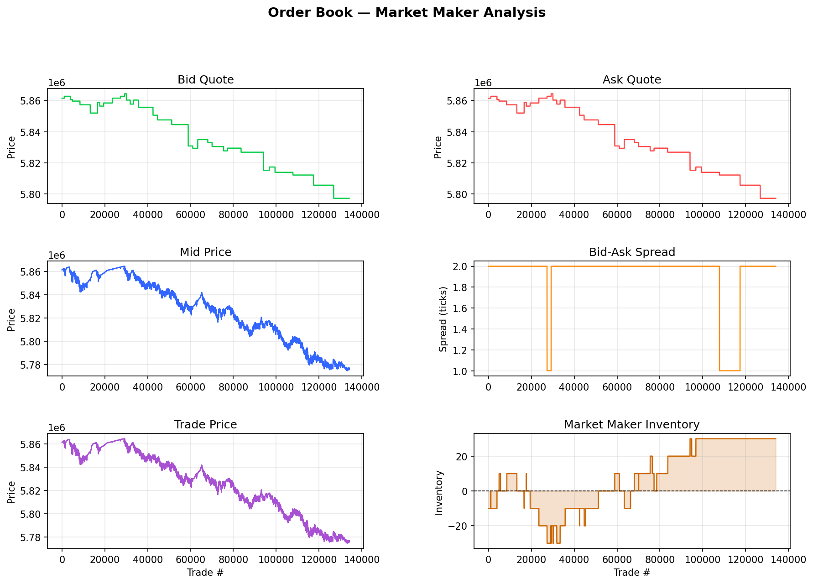

# Order Matching Engine 
A multithreaded C++ limit order book engine with a backtested Avellaneda-Stoikov market making strategy, implemented from scratch using lock-free data structures and synchronization primitives. 

Backtested on real L2 order book data from LOBSTER (AAPL, 5-level order book, 300,000+ events).

## Key Features:
- Multithreaded C++ engine.
- Uses a dedicated market maker thread to quote bids and asks using the Avellaneda-Stoikov Model.
- Bid and Ask orders are stored in a reader-writer locked order book which sorts these orders by price-time priority (best bid/ask price at the earliest time stored as a deque within an ordered map).
- Uses a lock-free SPSC queue to publish trades from the matching engine thread to the market maker thread, allowing the latter thread to update its bid and ask quotes in real-time.
- Uses synchronization primitives to avoid race conditions.

## Architecture:
- Matching Engine Thread: Processes incoming orders and matches their corresponding bids and asks by price-time priority. Orders are stored in a reader-writer locked order book (``std::map<price, std::deque<order>>``) supporting O(logn) insertion and O(1) lookup.
- Market Maker Thread: Consumes orders via a lock-free SPSC queue and recomputes bid/ask quotes using the Avellaneda-Stoikov Model in real time. Maintains a rolling volatility estimate over a 500-event window to dynamically update spread and reservation price.
- SPSC Queue: single-producer single-consumer lock-free queue connecting the matching engine to the market maker, avoiding mutex overhead on the critical path.

## Market Making Model:

Implements the Avellaneda-Stoikov Model. A market maker profits by continuously quoting a bid (buy price) and ask (sell price), earning the spread on round trips. The core challenge is matching inventory risk. If prices move against your position before you can offload it, losses exceed spread revenue.

To avoid this, A-S solves this by comparing two quantities:

### Reservation Price
$$r = s - q \cdot \gamma \cdot \sigma^2 \cdot (T - t)$$

The price the market maker actually wants to trade at, given current inventory $q$. When long ($q > 0$), $r$ shifts below mid, making the bid less aggressive and the ask more attractive, thereby driving inventory back toward zero.

### Optimal Spread
$$\delta = \gamma \sigma^2 (T-t) + \frac{2}{\gamma} \ln\left(1 + \frac{\gamma}{\kappa}\right)$$

This parameter denotes how wide to quote the reservation price. Two components:
- **Volatility term** $\gamma \sigma^2 (T-t)$: widens spread during uncertain conditions to protect against adverse selection
- **Liquidity term** $\frac{2}{\gamma} \ln\left(1 + \frac{\gamma}{\kappa}\right)$: driven by order arrival rate $\kappa$, higher $\kappa$ means more competition, tighter spread

### Parameter Calibration
| Parameter | Value | Description | Rationale |
|-----------|-------|-------------|-----------|
| $\gamma$ | $0.05$ | Risk aversion | Calibrated so inventory skew is meaningful at typical position sizes |
| $\kappa$ | $100$ | Order arrival rate | Produces ~2 tick spread, consistent with AAPL's typical quoted spread |
| $\sigma$ | Rolling | Volatility estimate | Log returns of BBO mid price, 5000-event rolling window |
| $(T-t)$ | Dynamic | Time remaining | Decays from $1.0 \to 0.01$ over session based on events processed |

### Risk Management

- **Hard inventory cap** at $\pm 20$ units, suppresses quotes on the side that worsens inventory when limit is breached
- **Soft control** via reservation price skew within the cap

### Known Limitations

- **Zero drift assumption**: A-S assumes prices follow arithmetic Brownian motion with no trend. On trending days the model is systematically picked off by informed flow, thereby buying into a falling market faster than the skew can compensate. This is a known theoretical limitation, not an implementation defect.
- **Static $\kappa$**: order arrival intensity is constant in the model but varies significantly intraday in reality
- **No queue position modeling**: fill logic does not account for queue position within a price level. In a real LOB, earlier orders at the same price fill first
- **Limited spread variation**: $\sigma$ changes slowly within the rolling window, limiting dynamic spread adaptation.

## Backtest Results (AAPL, trending day)

**Dataset**: LOBSTER AAPL L2 order book data, 5 levels of depth, ~300,000 events, 
~70,000 fills logged

**Market conditions**: ~1% intraday price decline ($58.60 → $57.80), 
strongly trending — worst-case scenario for A-S which assumes zero drift

| Metric | Result |
|--------|--------|
| Quoted spread | 1–2 ticks ($0.01–$0.02), consistent with AAPL's typical market spread |
| Spread behaviour | Dynamic, varies with rolling volatility estimate |
| Inventory range | ±25 units, mean-reverting around zero throughout session |
| Final PnL | ~-$5,000 (quote\_size=10), ~-$500 per unit |

### Interpretation

The model performs as expected given market conditions:
- Spread revenue is earned on round trips during calm periods, visible as PnLrises between trades 0-5k and 35k-40k.
- Adverse selection dominates during the steepest parts of the decline. Informed sellers systematically hit bids, driving inventory long and PnL negative.
- Hard inventory cap prevents catastrophic accumulation, allowing PnL to recover rather than decline further.
- Net result is a loss of roughly $500 per unit on a strongly trending day, which is consistent with the theoretical expectations of the A-S model under non-zero drift.

**Expected behaviour on a mean-reverting day**: inventory oscillations cancel out over time, spread revenue dominates, and PnL trends positive. 

## How to run:
1. Clone this repository.
2. Make sure you have cmake installed using ``cmake --version``.
3. If not, install it using ``sudo apt install cmake``.
4. Navigate to the cloned repository and run ``mkdir build && cd build``
5. Run ``cmake ..``.
6. Run ``make``.
7. Run ``./hft_lob``.
8. Run ``python plot.py`` in order to see the results.

## References
- Avellaneda, M. & Stoikov, S. (2008). *High-frequency trading in a limit order book*. Quantitative Finance, 8(3), 217-224.
